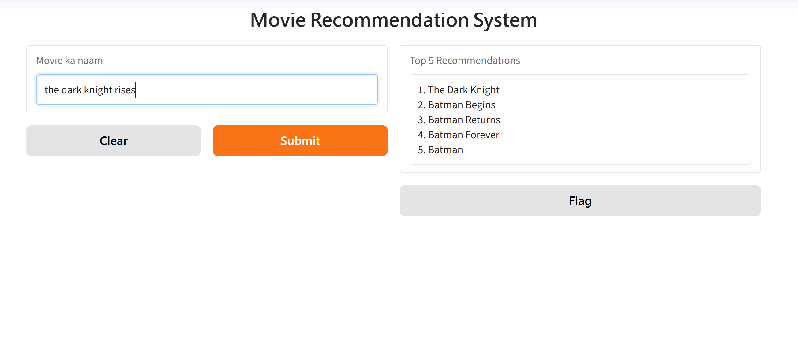
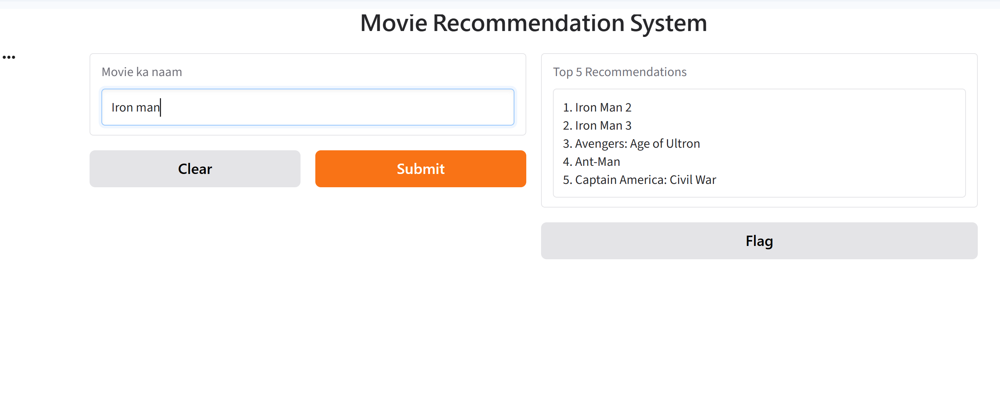

# Movie Recommendation System

A content-based movie recommendation system built using Machine Learning in Python.

## Problem
There are thousands of movies, and it is hard for a user to find one they will like.
This project suggests 5 similar movies based on a movie the user already likes.

## Dataset
TMDB 5000 Movie Dataset (Kaggle): `tmdb_5000_movies.csv` and `tmdb_5000_credits.csv`

## Method
1. Merged the movies and credits files.
2. Extracted genres, keywords, top 3 cast and director.
3. Combined everything with the overview and tagline into a single "tags" text.
4. Converted tags into vectors using CountVectorizer (5000 features).
5. Calculated similarity between all movies using Cosine Similarity.
6. Returned the top 5 most similar movies.

## Tools Used
Python, Pandas, NumPy, Scikit-learn, Gradio, Google Colab

## Output

## How to Run
1. Open `Untitled3.ipynb` in Google Colab.
2. Upload the dataset files (`archive.zip` from Kaggle).
3. Run all cells (Runtime, Run all).

## Limitations and Future Scope
- Uses only movie content, not user history or ratings.
- Dataset only has movies up to 2017.
- Can be improved with TF-IDF, BERT, or collaborative filtering.

## Author
Krish Saini
